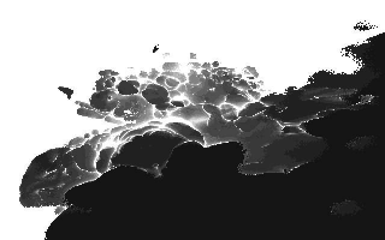

# brainlez Coders! : inkblots

A 512 byte DOS intro written by pestis / bC!, submitted to the Lovebyte
2024 512b intro competition.

Source code: https://github.com/vsariola/inkblots

Capture: https://youtu.be/PwvUZLnnzu8

Developed on DOSBox, using dynamic core and max cycles. No idea how much cycles
needed.

There is a dosbox.conf file included in the repo; not sure if this the best
configuration to watch the intro, but that's what it was developed on.

Massive love to everyone replying my endless questions on the sizecoding #86
channel! I hope you get something back in the form of this intro.

Greets to: superogue, TomCat, gopher, jobe, HellMood, psenough, jeenio, Řrřola,
p01, nesbox, okkie, exoticorn, baze, Virgill, byteobserver, ferris, Ped7g,
Dresdenboy, aldroid, hannu, wrighter, dave84, havoc, unlord, noby, LJ, PoroCYon,
sensenstahl, Blossom, deater, ilmenit, Fready, Jin X, gasman, DevEd, bitl,
wbcbz7, teadrinker, Pellicus, GoingDigital, las, mentor, iq, blueberry, fizzer,
gargaj, pOWL, silvia, MartiniMoe, NR

## Building

You need [nasm](https://nasm.us/). Then:

```
nasm inkblots.asm -fbin -o inkblots.com
```

## Tracker

I made a tiny tracker with a crappy GUI to compose the MIDI music; the tracker
is in the (doh) tracker folder. The thing is running on python. I didn't make
any way to actually export the song - I just reimplemented the song in DOS once
I had something I liked.

```
cd tracker
poetry install
poetry run main.py
```

My song is in autosave.json; first thing I did was autosave, because I've lost
so much music to my own software crashing ;)

## Shader

I prototyped the raymarcher in
[Shadertoy](https://www.shadertoy.com/view/4fjXWc). The fractal was first some
kind of [kaleidoscopic
IFS](http://www.fractalforums.com/sierpinski-gasket/kaleidoscopic-(escape-time-ifs)/)
but then glitched it to something that would be simple enough to implement using
the x87 FPU instructions. The critical part was the SDF:

```
const float ODIV = 3.141592;
const int ITERS = 12;
const float LEVEL = 1.7;
float o = (1.+cos(p.x))/ODIV;
vec3 t = p;
for(int j=0; j<ITERS; j++){
    t.x = abs(t.x - round(t.x));
    t.xyz = t.yzx;
    t.x += t.x;
    r += t.x*t.x;
    t.x += t.z * o;
    t.z -= t.x * o;
}
float dist = sqrt(r)-LEVEL;
```

The idea was to perform math mostly using one coordinate at a time, and then use
coordinate shuffling to do similar math with other coordinates, all while doing
foldings, rotations and scalings, and hope we find some kind of fractal there.
And we did :) But someone smarter than me can analyze why the hell it still
works.

The reasoning behind each line:
  1) `t.x - round(t.x)` is domain repetition. On `x87`, `FRNDINT` does this very
     cheaply.
  2) `abs(...)` achieves folding of the space. This becomes `FABS` instruction.
  3) `t.xyz = t.yzx` shuffles the coordinates. This becomes a pair of `FXCH`
     instructions.
  4) `t.x += t.x` is same as `t.x *= 2.` i.e. this is the "scaling" of a
     kaleiodoscopic IFS.
  5) `r += t.x*t.x` is the weirdest part: instead of computing the `length(t)`
     as is typical for kaleidoscopic IFSs, we make some kind of "cumulative
     distance squared". I really don't know why it works. Also note that
     shuffling is done before this, so the first two times this is done, the
     coordinates have not undergone domain repetition yet. So, we get fractal
     that is is finite in two directions, but infinite in one direction. I
     didn't like the fractal being infinite in all directions; it felt too much
     like flying inside domain repeated SDF.
  6) `t.x += t.z * o;` and `t.z -= t.x * o;` is a poor, glitchy rotation around
     y-axis. The amount of rotation depends with the `p.x`, so the fractal
     changes.
  7) Finally, since `r` is `t[0].x^2 + t[1].x^2 + ...`, the final line `float
     dist = sqrt(r)-LEVEL` is something like the SDF of ball.

Shading is simply based on the number of steps until reaching MINDIST.

The shader version shows just how glitchy the SDF is, but the slow pace, poor
resolution and dithering of the DOS version help a lot here.

## License

[MIT](LICENSE)

